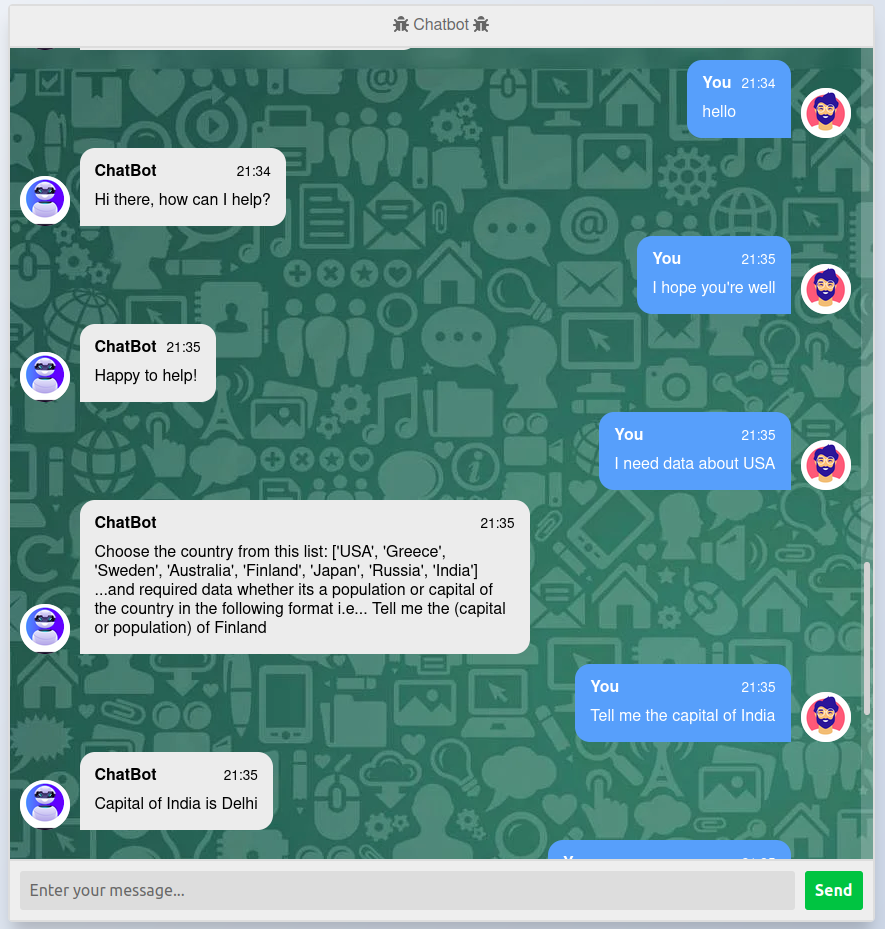
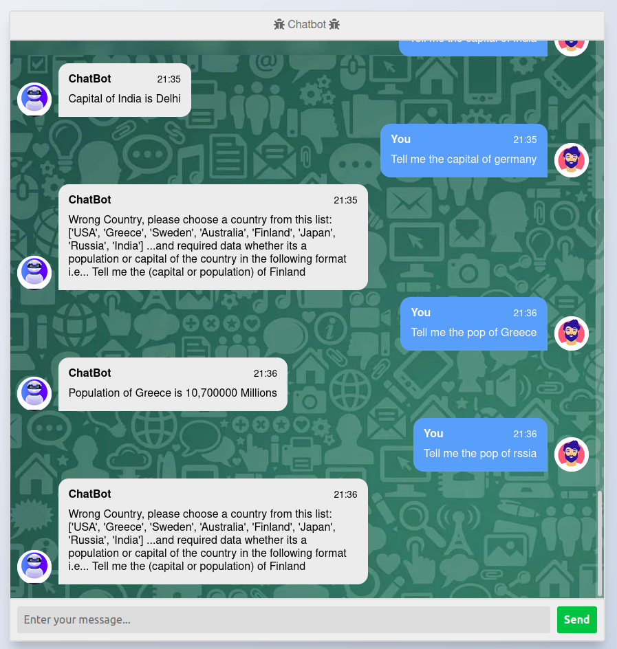

# Chatbot

## Project Overview:

The target from this task is to implement a basic chatbot for certain test chat cases and provide the user with capitals and population of specific countries and tseting this chatpot using FAST API


#### Chat Cases:
  * Greeting
  * Asking for countries capital or population
  * selection of wrong country
  * Thanking 

### Chatbot Basic Approach:

Providing examples of words that maybe occurred in the chat cases messages and provide the suitable responses to reach user required answers
  
#### Testing Basic Chatbot command lines:
  ```sh
  git clone https://github.com/MohamedHesham02/Chatbot.git
  cd Chatbot
  pip install fastapi uvicorn
  uvicorn Chatbot_api:app --reload
  ```
##### open browser and write url: 127.0.0.1:8000/docs

  or 
  
  ```sh
  git clone https://github.com/MohamedHesham02/Chatbot.git
  cd Chatbot
  python Chatbot_without_api.py
  ```
  
#### Advantages of Basic Chatbot:
  * Easier to implement in case of low no. in chat cases
  * Faster implentation
  
#### Problems in Basic Chatbot:

  * Failing in any worng Letter in the words may cause of misunderstanding or stopping error 
  * Limited at test cases and imporvements that could be used 
  
#### Deep Learning Approach:

Providing examples of words that maybe occurred in the chat cases messages with probablilty and weightening advantage, tokenizing of every character which provide advantage of prediction based on the labelling of each chat case to for best providing of suitable responses to reach user required answers and reduce error term

#### Advantages of Deep Learning Chatbot:
  * Tokenizing of every character in chat cases for better understanding the label 
  * probablilty and weightening advantage to predict the label or class 
  * Reducing Errors 
  * Best providing of suitable responses
  
  
#### Problems in Deep Learning Chatbot:

  * Slower implentation
  * Higher complexity 
  
#### Testing Basic Chatbot command lines:

  ```sh
  git clone https://github.com/MohamedHesham02/Chatbot.git
  cd Chatbot
  pip install -r requirements.txt
  cd DL_Approach
  python app.py
  ```
 
##### open browser and write url: 127.0.0.1:5000


### Test Deep Learning Chatbot Demo



